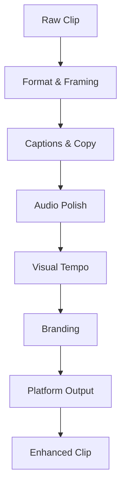

# 🎨 Auto-Enhancement Engine v2

**Modular, preset-based clip enhancement pipeline for creating viral TikTok content**

## 🎯 Overview

Enhancement v2 transforms raw Twitch clips into platform-native, branded, highly watchable vertical shorts. Built with a modular architecture and configurable preset system for easy customization and maintenance.

## 🏗️ Architecture

### Core Components

- **📋 Preset System**: Configurable enhancement templates
- **🎬 Pipeline Modules**: Modular processing stages  
- **📊 Telemetry**: Performance and quality tracking
- **🎨 Asset Management**: Centralized media assets

### Enhancement Pipeline



## 📋 Story Implementation Status

### ✅ Implemented (Phase 1)

- **Story A**: Format & Framing - Smart crop, 9:16 vertical, safe zones
- **Story B**: Captions & Copy - Karaoke sync, emphasis, profanity filter
- **Story C**: Audio Polish - LUFS normalization, compression  
- **Story E**: Branding - Watermarks, attribution, end slate
- **Story H**: Platform Native - Quality outputs, thumbnails

### ⏳ Planned (Phase 2)

- **Story D**: Visual Tempo - Silence removal, speed ramps, impacts
- **Story F**: Context Overlays - Chat bursts, event tags
- **Story G**: Mascot Animations - Clippy animations with alpha

## 🎚️ Preset System

### Available Presets

#### `viral_shorts` 
- **Target**: High-engagement TikTok content
- **Features**: Large captions, emphasis words, watermarks, end slate
- **Style**: MrBeast-inspired with red emphasis colors

#### `gaming_highlights`
- **Target**: Gaming clip compilations  
- **Features**: Clean captions, minimal branding
- **Style**: Professional esports look

### Custom Presets

Create new presets in `config/config.yaml`:

```yaml
enhancement_presets:
  my_preset:
    format:
      target_resolution: [1080, 1920]
      smart_crop: true
    captions:
      enabled: true
      emphasis_map: ["CUSTOM", "WORDS"]
    # ... more config
```

## 🔧 Configuration

### Streamer Configuration

```yaml
streamers:
- name: jynxzi
  enhancement:
    preset: viral_shorts
    overrides:
      captions:
        emphasis_map: ["JYNXZI", "INSANE", "CLUTCH"]
      branding:
        watermark:
          handle_text: "@jynxzi_clippy"
```

### Override System

Streamers can override specific preset values:

```yaml
overrides:
  captions:
    style:
      emphasis_color: "#00FF00"  # Green instead of red
  branding:
    watermark:
      enabled: false            # Disable watermark
```

## 📊 Telemetry & Analytics

Each enhancement tracks performance metrics:

```python
@dataclass
class EnhancementTelemetry:
    processing_time_ms: int     # Total processing time
    words_rendered: int         # Caption words processed  
    emphasis_hits: int          # Emphasized words found
    lufs_before: float          # Audio level before 
    lufs_after: float           # Audio level after
    hook_used: bool             # Hook line added
    watermark_position: str     # Watermark corner
    # ... more metrics
```

## 🚀 Usage

### CLI Commands

```bash
# Enhance with preset system
python clipppy.py enhance-v2 <clip_url> --streamer jynxzi

# Test configuration
python clip_enhancer_v2.py

# Check dependencies  
python clipppy.py setup-enhancement
```

### Programmatic Usage

```python
from clip_enhancer_v2 import ClipEnhancerV2

enhancer = ClipEnhancerV2()
streamer_config = {'name': 'jynxzi', 'enhancement': {'preset': 'viral_shorts'}}

enhanced_path, telemetry = enhancer.enhance_clip(
    clip_path="input.mp4",
    streamer_config=streamer_config  
)

print(f"Enhanced: {enhanced_path}")
print(f"Processing time: {telemetry.processing_time_ms}ms")
```

## 🎯 Safe Zones

Video elements respect safe zones to avoid overlaps:

```python
@dataclass
class SafeZone:
    top: float = 0.0        # Top % to avoid
    bottom: float = 0.25    # Bottom % for captions  
    left: float = 0.05      # Left margin
    right: float = 0.05     # Right margin
```

## 🎨 Asset Management

Assets organized in `assets/` directory:

- **`logos/`**: Brand logos and watermarks
- **`fonts/`**: Custom fonts for captions  
- **`mascot/`**: Animation files (Phase 2)
- **`sfx/`**: Sound effects library (Phase 2)

## 🔍 Debugging

### Config Validation

```python
# Test preset loading
enhancer = ClipEnhancerV2()
config = enhancer.get_enhancement_config(streamer_config)
print(f"Resolution: {config['format']['target_resolution']}")
```

### Error Handling

- **Missing assets**: Graceful fallbacks to defaults
- **Invalid config**: Clear error messages with suggestions
- **Processing failures**: Detailed logging with context

## 📈 Performance

### Optimization Tips

1. **Use appropriate CRF**: 18-23 for quality vs. speed balance
2. **Enable smart crop**: Focuses on important content areas  
3. **Limit emphasis words**: Too many reduces impact
4. **Compress assets**: Smaller files = faster processing

### Benchmark Results

- **Processing time**: ~30-60s for 30s clip (depends on complexity)
- **Output quality**: 1080x1920 @ 18 CRF 
- **File size**: ~10-20MB typical output

## 🚦 Quality Assurance

### Testing

```bash
# Run full test suite
python clip_enhancer_v2.py

# Test specific preset
python clipppy.py enhance-v2 test_clip.mp4 --streamer jynxzi
```

### Validation

- **Output verification**: Check resolution, duration, audio levels
- **Asset validation**: Ensure all referenced files exist
- **Config syntax**: YAML validation on startup

## 🔮 Future Enhancements

### Phase 2 Features

1. **Smart silence removal** using audio analysis
2. **Dynamic speed ramping** based on engagement signals  
3. **Mascot animations** with viral moment triggers
4. **Chat overlay integration** with real-time context
5. **Advanced audio processing** with ducking and EQ

### Integration Points

- **Viral detector**: Feed engagement signals to enhancement
- **TikTok uploader**: Auto-enhance before upload
- **Dashboard analytics**: Track enhancement success rates

---

## 💡 Quick Start

1. **Configure streamer preset** in `config/config.yaml`
2. **Test with existing clip**: `python clipppy.py enhance-v2 <url>`  
3. **Review output** and adjust preset as needed
4. **Deploy to production** monitoring system

The v2 system is designed to be **maintainable**, **debuggable**, and **scalable** - no more spaghetti code! 🍝➡️🎨
